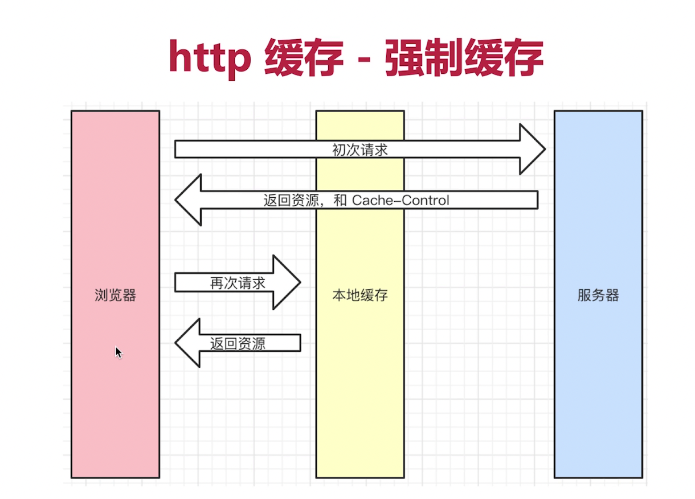
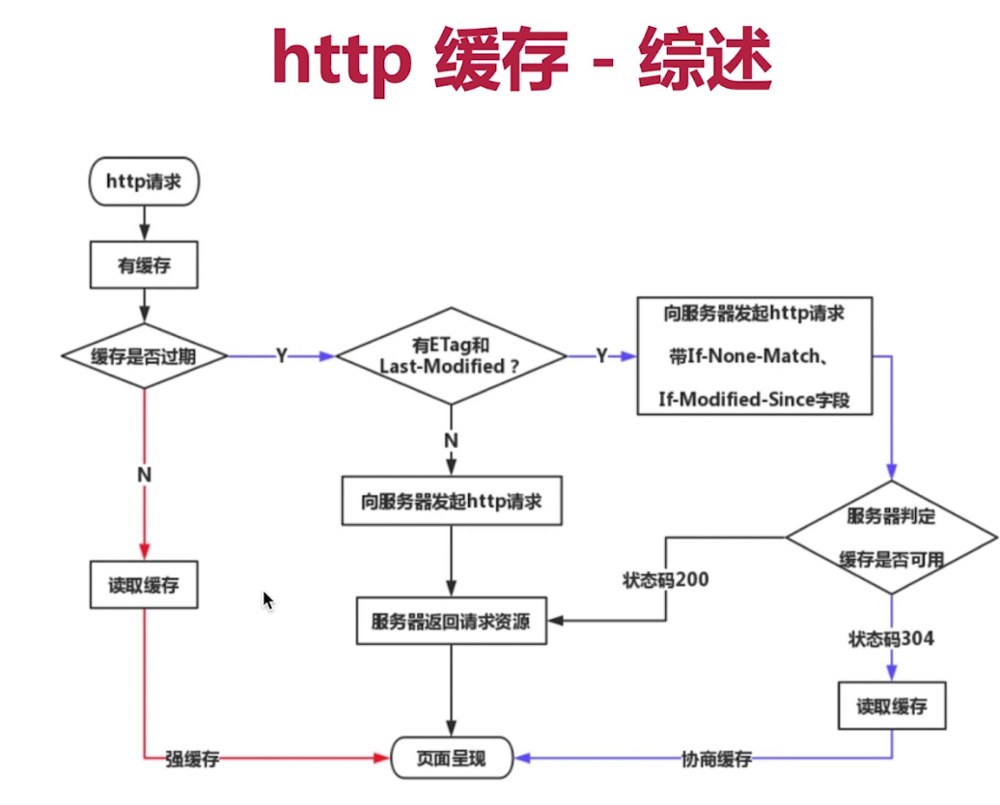

# 第十四章-http 面试题
## 题目
### 1. http常见状态码有哪些
### 2. http常见的header有哪些
### 3. 什么是restful API
### 4. 描述下http缓存机制（重要）

## 知识点
### http状态码
#### 1. 状态吗分类
1. 1xx服务器收到请求（服务端还没有返回）
2. 2xx请求成功，如200
3. 3xx重定向，如302
4. 4xx客户端错误，如404
5. 5xx服务端错误，如500

#### 2. 常见状态码
1. 200：成功
2. 301：永久重定向（配合location，浏览器会自动处理，浏览器记住后就不会再访问原网址）
3. 302：临时重定向（配置location，浏览器会自动处理）
4. 304：资源未被修改
5. 404：资源未找到
6. 403：没有权限
7. 500：服务器错误
8. 504：网关超时

#### 3. 关于协议和规范
1. 就是一个约定
2. 要求大家都跟着执行
3. 不要违反规范，例如IE浏览器
### http methods
#### 1. 传统的methods
1. get获取服务器的数据
2. post像服务器提交数据
3. 简单的网页功能，就这两个操作
#### 2. 传统的methods
1. get获取数据
2. post新建数据
3. patch/put更新数据
4. delete删除数据
#### 3. RESTFUl API
1. 一种新的API设计方法（早已推广使用）
2. 传统API设计：把每一个url当作一个功能
3. restful API：把每个url设计诚一个资源
#### 4.如何设计成一个资源？
1. 尽量不使用URL参数
2. 用method表示操作类型

#### 5.http Headers
1. 常见的Request Headers（在前端可以自定义）
    1. Accept 浏览器可接受的数据格式
    2. Accept-encoding 浏览器可以接受的压缩算法，如gzip
    3. Accept-language 语言
    4. connection：keep-alive 一次TCP连接重复使用
    5. cookie 同域都会把cookie发出去
    6. host 请求的域名
    7. User-Agent：浏览器、操作系统

2. 常见的Response headers（在服务端可以自定义）
    1. Content-type 返回数据格式，如application/json
    2. Content-length 返回数据的大小
    3. Content-encoding 返回数据的压缩算法，如gzip，浏览器根据这个算法解压
    4. Set-Cookie 服务端修改cookie

3. 缓存相关的headers
    1. cache-Control Expires
    2. Last-Modified If-Modified-Since
    3. Etag If-None-Match
### http缓存
1. 关于缓存的介绍
    1. 什么是缓存？ 第一次访问后，把资源缓存到本地，方便下次访问。
    2. 为什么需要缓存？ 有缓存可以减少服务端压力，减少发送的数据，节省时间和资源。
    3. 哪些缓存可以被缓存？——静态资源（js css img）
2. http缓存策略（强制缓存 + 协商缓存）
    1. 
    2. 协商缓存：服务端判断是否可以缓存，服务器判断客户端资源，是否和服务端资源一样，一致返回304，否则返回200和最新资源
    3. 
3. 刷新操作方式，对缓存的影响
4. cache-control的取值
    1. max-age 缓存过期事件
    2. no-cache 不采用强制缓存
    3. no-store 不使用任何缓存
    4. private允许用户做缓存
    5. public允许路由做缓存
5. Expires
    1. 同在Response Headers中
    2. 同为控制缓存过期
    3. 已被cache-control代替
6. 资源标识
    1. 在Response headers中有两种
    2. Last-Modified 最后修改时间。（只能精准到秒）
    3. Etag 标签，类似于指纹。（优先使用）
    4. 资源被重复生成，内容不变，Etag更精准。

7. 总结
    
### 三种刷新方式
1. 正常操作:输入url，跳转链接，前进后退
2. 手动刷新：F5，点击刷新按钮，右击菜单刷新
3. 强制刷新：ctrl + F5

### 三种刷新策略
1. 正常操作：强制缓存和协商缓存有效
2. 手动刷新：强制缓存失效，协商缓存有效
3. 强制刷新：强制缓存失效，协商缓存失效