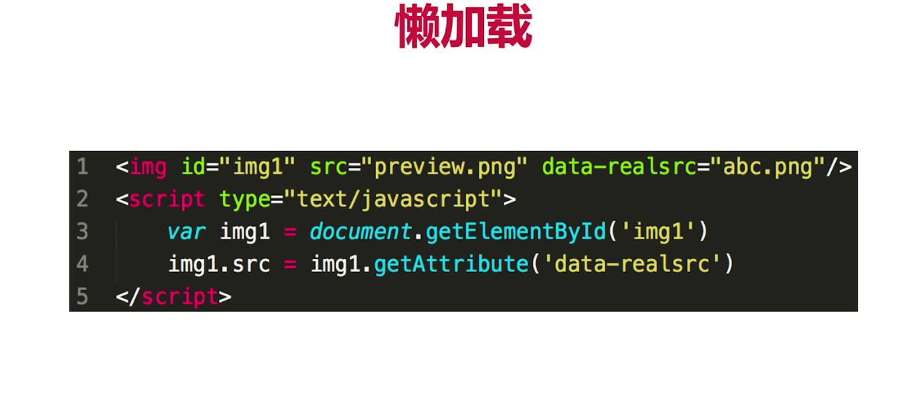

# 第十六章-运行环境
## 注重点
1. 运行环境即浏览器（服务端有nodejs）
2. 下载网页代码，渲染出页面，期间会执行若干js
3. 要保证代码在浏览器中：稳定且高效
4. 网页加载过程
5. 性能优化（体验优化）
6. 安全

## 题目
1. 从输入url到渲染出页面的整个过程
2. window.onload 和 DOMContentLoaded的区别

## 知识点
1. 加载资源的形式
    1. html代码
    2. 媒体文件、图片、视频等
    3. JavaScript和css
2. 加载资源的过程
    1. DNS解析：域名 -> IP地址
    2. 浏览器根据IP地址向服务器发起http请求
    3. 服务器处理http请求，并返回浏览器

3. 渲染页面的过程
    1. 根据HTML代码生成DOM Tree
    2. 根据CSS生成CSSOM
    3. 将DOM tree 和 CSSOM整合形成Render Tree
    4. 根据Render Tree渲染页面
    5. 遇到script标签则暂停渲染，优先加载并执行JS代码，完成后再渲染。
    6. 直到把Render Tree渲染完成

## 思考题
1. 为什么把css放在头部？  
    原因:为了性能，如果放在底部，会把DOM加载后再次加载CSSOM然后改变DOM导致需要重新渲染。（放在head可以一步渲染完成）
2. 为什么把js放在最后  
    原因:先把DOM树给用户看到，预先加载好。然后js要处理任务再去处理任务。
3. 在p标签放在img  
    原因：不会阻塞DOM渲染过程。
4. window.onload 和 DOMContentLoaded的区别  
    1. 区别:页面全部资源加载完毕才会执行，包括图片视频，第二个：DOM渲染完毕即可，此时图片等可能没有加载完毕
    2. 对应API:window.addEventListener('load',()=>{}) 和 document.addEventListener('DOMContentLoaded',()=>{})

## 性能优化
### 知识点
1. 综合性问题，没有标准答案，要求尽量全面
2. 某些细节问题可能会单独提问：手写防抖，节流
3. 只关注核心点，针对面试

 ### 原则
 1. 多使用内存、缓存或其它方法
 2. 减少CPU计算量，减少网络加载耗时
 3. 空间换时间

 ### 从何入手
 #### 1. 让加载更快
 1. 减少资源体积：压缩代码
 2. 减少访问次数：合并代码，SSR服务器渲染，缓存（访问3个3kb和1个9kb时间是不一样的）
 3. 使用更快的网络：CDN

 #### 2. 让渲染更快
4. css放在head，js放在body最下面
5. 尽早开始执行JS，用DOMContentLoaded触发
6. 懒加载（图片懒加载，滑倒哪加载到哪）
7. 对DOM查询进行缓存
8. 缓存DOM操作，合并一起插入DOM结构
9. 节流throttle 防抖 debounce

### 缓存
1. 静态资源加hash后缀，根据文件内容计算hash
2. 文件内容不变，则hash不变，则url不变
3. url和文件不变，会触发http缓存机制，返回304

### SSR
1. 服务端渲染：将网页和数据一起加载，一起渲染
2. 非SSR：先加载网页，通过ajax加载数据，再渲染数据
3. 早先的JSP，ASP，PHP 也是 SSR

### 懒加载

### 防抖 debounce
1. 监听输入框，文字变化触发change事件
2. 直接用keyup事件，则会频繁触发change事件
3. 防抖：用户输入结束或暂停时，才会触发change事件

### 节流 throttle
1. 拖拽一个元素时，要随时拿到元素被拖拽的位置
2. 直接用drag事件，则会频发触发，很容易导致卡顿
3. 无论拖拽速度多块，都会每隔100ms触发一次

## 安全
### 知识点
1. 问题：常见的web前端攻击方式？
    1. xss 跨站请求攻击
        1. 一个博客网站，我发表一篇博客，其中潜入一个script脚本
        2. 获取cookie，发送到我的服务器（服务器配合跨域）
        3. 发布这篇博客，有人查看它，我轻松收取访问者的cookie
        4. xss预防方法:
            1. 替换特殊字符，如<变&lt >变&gt
            2. script变成编码，直接显示，而不会作为脚本执行。
            3. 前端要替换，后端也要做替换。（替换）
        5. xsrf攻击

2. xsrf 跨站请求伪造
    1. 付费结构是xxx.com/pay?id=100
        1. 我向你发送一封电子邮件，标题很诱人，用img标签传入src跨域进行访问。
        2. 预防方案
            1. 使用post接口
            2. 增加验证，验证密码、短信验证码、指纹等

