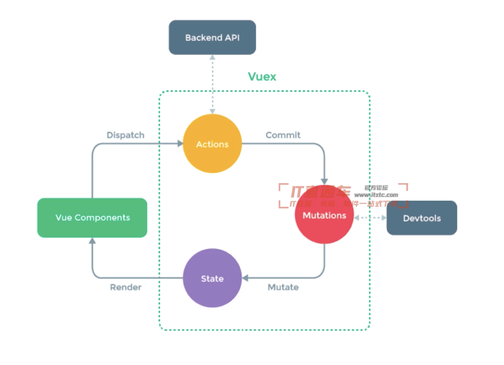

# 知识点串讲
## Vuex使用
1. 面试考点并不多（因为熟悉Vue之后，vuex没有难度）
2. 但基本概念、基本使用和API必须掌握
3. 可能考察state的数据结构设计（后面会讲）
### vuex基本概念
1. state
2. getters
3. action(⚠️只要这里能做异步操作，整合多个multations)
4. multation（原子操作）
### 用于vue组件
1. dispatch
2. commit
3. mapState
4. mapGetters
5. mapActions
6. mapMutations
### 图

## vue-router使用
1. 面试考点不多
2. 路由模式（hash、h5 history）
3. 路由配置（动态路由，懒加载）
### vue-router模式
1. hash模式（默认），如http://xxx.com/#/user/10
2. H5 history模式，如http://xxx.com/user/10
3. 后者需要server端支持，因此无特殊需求可选择前者
## vuex，vue-router总结
1. 掌握基本概念，基本使用
2. 面试官时间有限，需考察最核心、最常用的问题，而非边角问题
## Vue使用-总结
1. 基本使用、组件使用
2. 高级特性
3. Vuex和Vue-router使用
## 面试题答案
### 1. v-show和v-if的区别
    v-if是条件渲染（如果是false不会更新到dom）
    v-show是display:none，也就是仅仅不显示而已

### 2.v-for中为什么要用key
    要与业务相关的key，保证唯一
### 描述Vue组件生命周期（有父子组件的情况）
### 3.Vue组件如何通讯
    1. 通过属性和触发事件
    2. 通过自定义事件
    3. 通过vuex进行通讯
### 4.描述组件渲染和更新的过程
### 5.双向数据绑定v-model的实现具体原理