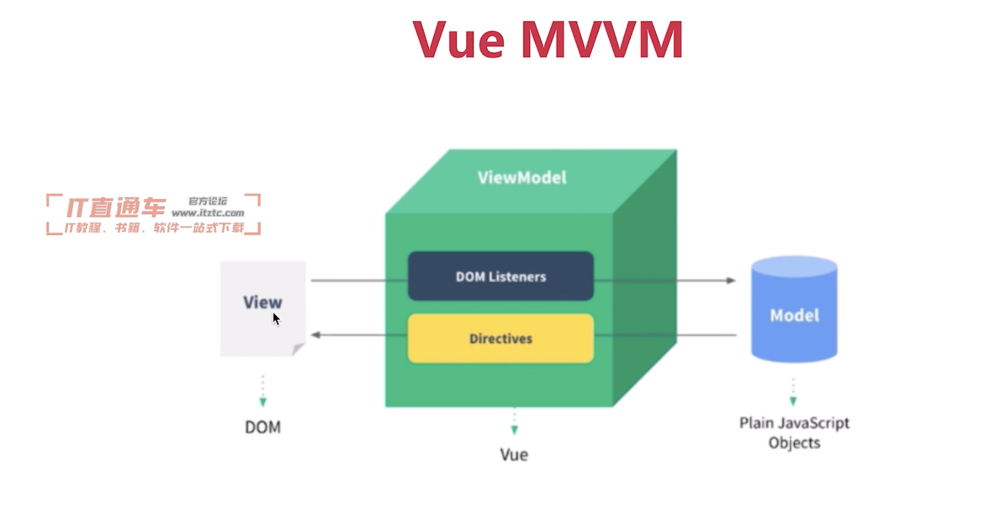

# Vue原理（大厂必考）
## 思考
1. 面试为何考察原理，又用不到？
   1. 知其然知其所以然
   2. 了解原理，才能应用的更好
   3. 大厂造轮子（有钱有资源，业务定制，技术KPI）

2. 面试如何考察？以何种方式？
   1. 考察重点而不是考察细节。掌握好2/8原则
   2. 和使用相关的原理，例如vdom、模板渲染
   3. 整体流程是否全面？热门技术是否有深度？

3. Vue原理包括哪些？
    1. 组件化
    2. 响应式
    3. ⚠️vdom和diff算法
    4. 模板编译
    5. 渲染过程
    6. 前端路由
## 组件化基础（MVVM模型）
1. “很久”以前就有组件化
   1. asp、jsp、php已经有组件化
   2. nodejs中也有类似的组件化

2. 数据驱动视图（MVVM，setState）
   1. 传统组件，只是静态渲染，更新还要依赖于操作DOM
   2. 根据数据会自动渲染DOM
   3. 

## Vue响应式
1. 组件data的数据一旦变化，立刻触发更新
2. 实现数据驱动视图的第一步
3. 考察Vue原理的第一题