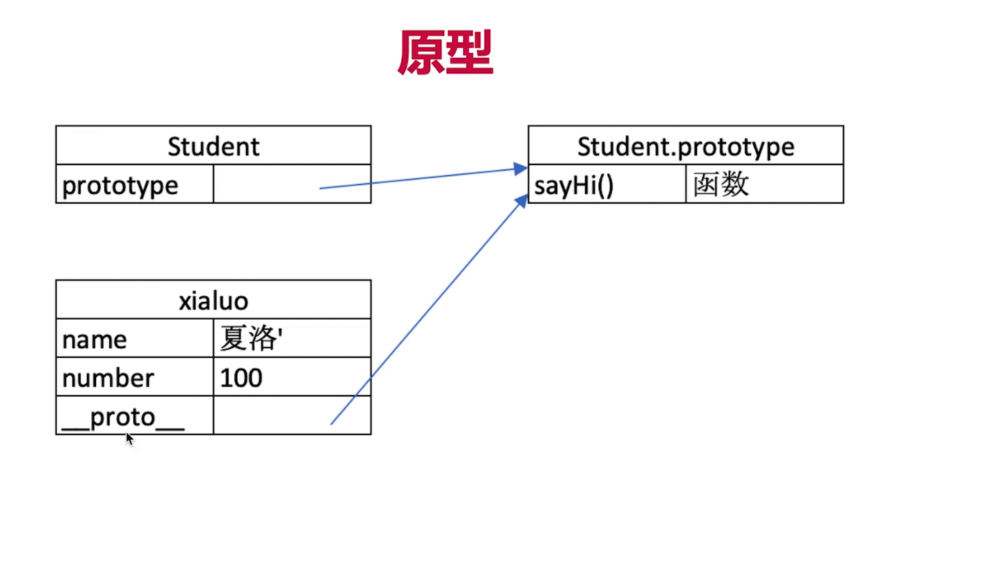
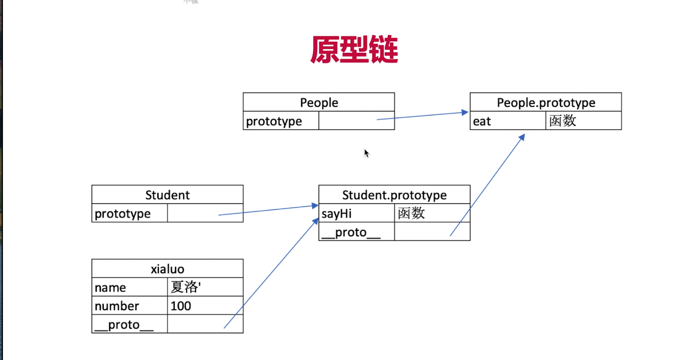
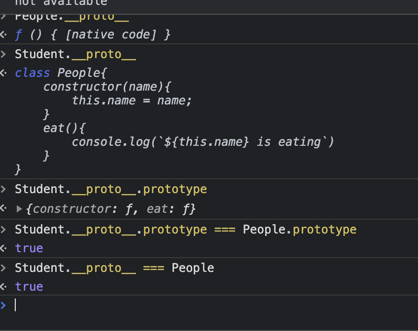
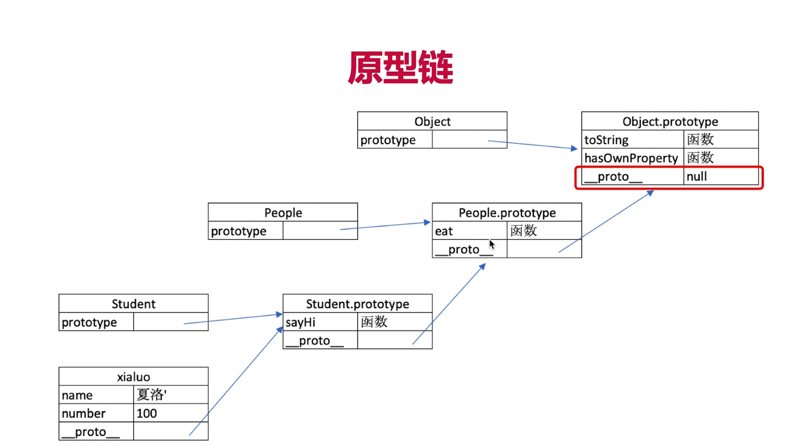
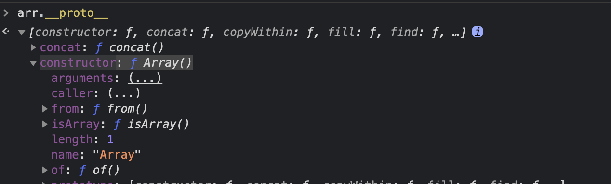

# 第五章-原型原型链
## 介绍
js是基于原型继承的语言(es6后的class实际上也是个原型链)  
## 题目
### 1. 如何判断一个变量是不是数组？
### 2. 手写一个简易的jquery，考虑插件和扩展性  
### 3. class的原型本质

## 知识点
### 1.class
#### 主要知识点：
1. contractor构造方法
2. 属性
3. 方法
#### 类的代码演示：
```js
class Student{
    constructor(name,number){
        this.name = name;
        this.number = number;
    }
    sayHi(){
        console.log(`姓名:${this.name},学号:${this.number}`);
    }
//通过类new对象/实例
const xiaowei = new Student("xiaowei",1);}
```
#### 继承的代码演示：
```js
class People{
    constructor(name){
        this.name = name
    }
    eat(){
        console.log(`${this.name} eat something`)
    }
}
class Student extends People{
    constructor(name,number){
        super(name)
        this.number = number
    }
    goStudy(){
        console.log(`姓名 ${this.name} 学号 ${this.number}`)
    }}
```
### 2.类型判断
#### 主要知识点
通过instanceof来判断类型
#### 代码演示
```js
function(){
    xiaowei instanceof People //true
    xiaowei instanceof Student //true
    xiaowei instanceof Object //true

    [] instanceof Array //true
    [] instanceof Object //true
    {} instanceof Object //true
}
```
### 3.原型
#### 主要知识点
1. __proto\_\_ 是隐式原型  
2. prototype是显式原型  
3. 原型关系  
    1. 每个class都有显示原型prototype
    2. 每个实例都有隐式原型__proto\_\_
    3. 实例的__proto\_\_指向对应class的prototype
4. 基本执行规则
    1. 获取属性xiaowei.name,或执行方法时
    2. 先在自身方法中寻找
    3. 如果找不到前往__proto\_\_内去寻找，而__proto\_\_内就指向class的prototype

#### 代码演示
```js
typeof Student // 'function'
```
### 4.原型链
#### 主要知识点
1. 原理图
2. 调试测试图
3. 最终关系图
#### 代码演示
```js
console.log(Student.prototype.__proto__)
console.log(People.prototype)
console.log(People.prototype === Student.prototype.__proto__) // true
```
## 解答
### 问题1:
可以通过xxx instanceof Array来判断  
### 问题2代码:
```js
        console.log('jq demo')
        class jQuery{
            constructor(selector){
                //dom 查询
                if (typeof(selector) === 'string'){
                    let temp = selector.split('')[0] || null
                    let result = []
                    if (temp == '#'){
                        const res = document.getElementById(selector.substring(1,selector.length))
                        result.push(res)
                    }else if(temp == '.'){
                        result = document.getElementsByClassName(selector.substring(1,selector.length))
                    }else{
                        result = document.getElementsByTagName(selector)
                    }
                    const length = result.length
                    for(let i=0;i<length;i++){
                        this[i] = result[i]
                    }
                    this.length = length
                }else{
                    return Error("can not under stand selector")
                }
                
            }
            get(index){
                return this[index]
            }
            each(fn){
                for(let i = 0;i<this.length;i++){
                    const elem = this[i]
                    fn(elem)
                }
            }
            on(type, fn){
                return this.each(elem=>{
                    elem.addEventListener(type,fn,false)
                })
            }
            html(str){
                return this.each(elem=>{
                    elem.innerHTML = str
                })
            }}
        //插件形式
        jQuery.prototype.dialog = function(info){
            alert(info)
        }
        //复写
        //使用extends
        $ = function(elem){
            return new jQuery(elem)
        }
```
### 问题3:
1. 原型和原型链的图示
2. 属性和方法的执行规则
## 补充
### instanceof 原理
通过原型链找到最高级别的proto，然后判断类型。  
测试图: