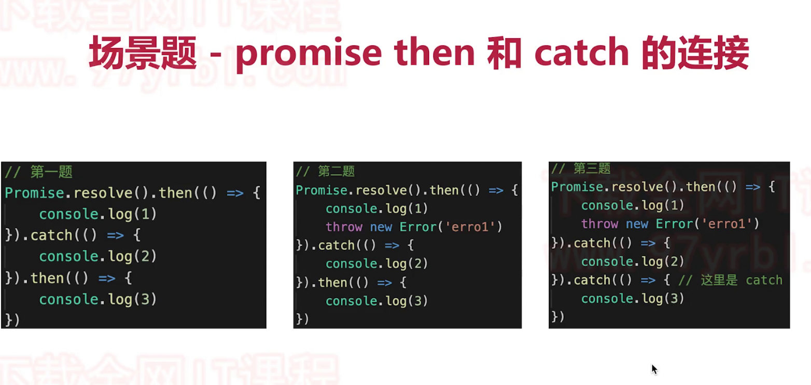
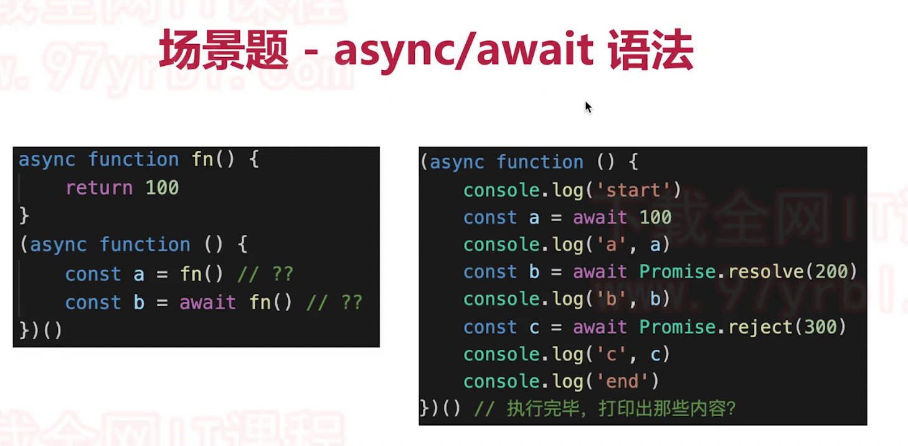
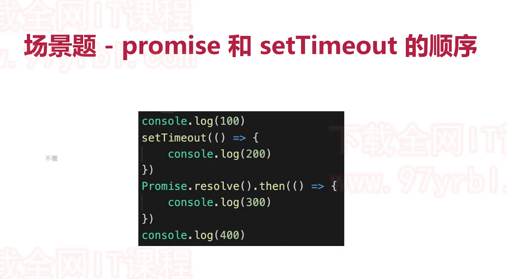
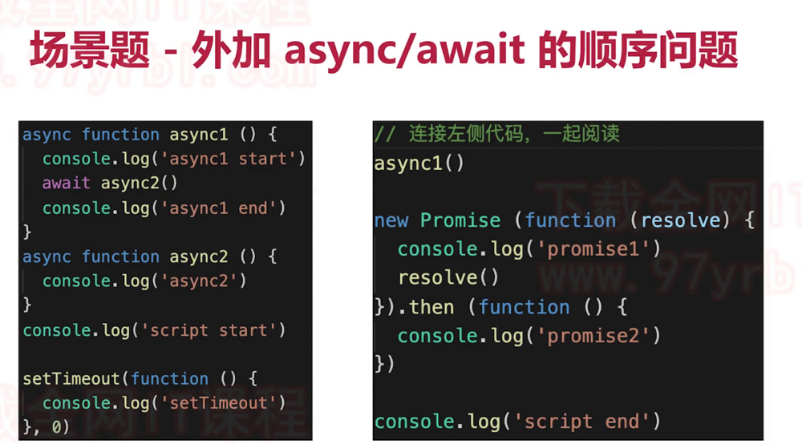
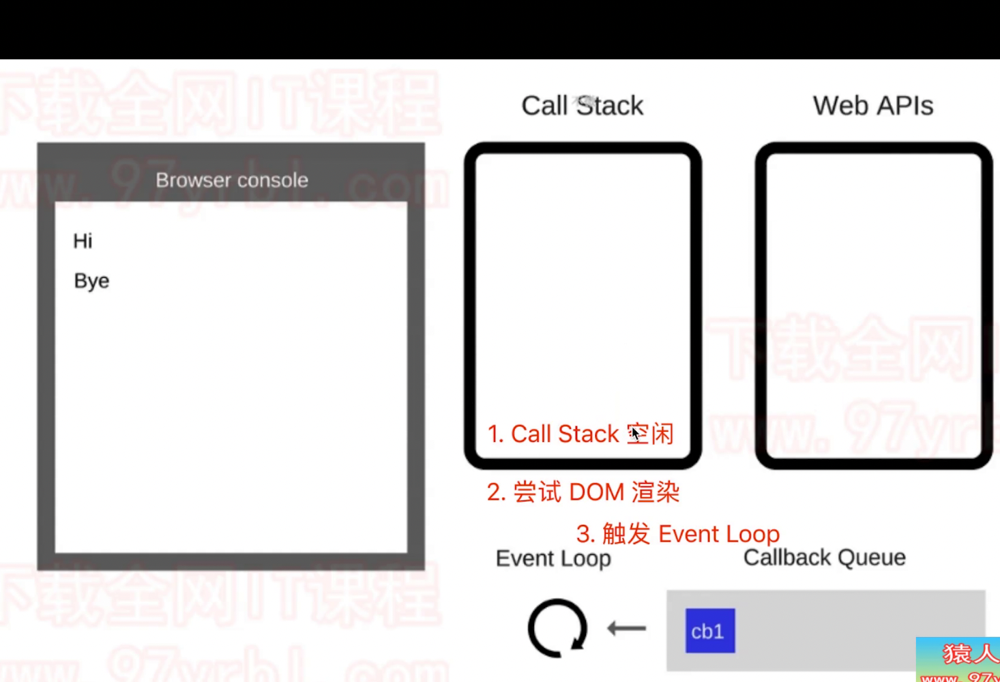
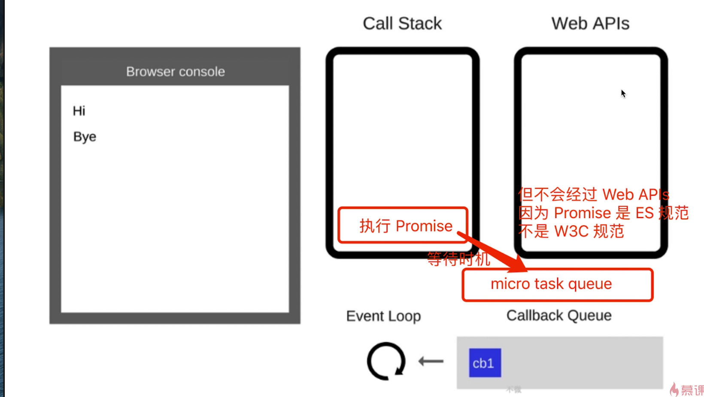

# 第八章-js单线程与js异步进阶
## 主要内容
1. event loop
2. promise进阶
3. async/await
4. 微任务/宏任务
## 面试题
1. 请描述event loop的机制，可画图
    1. 自行回顾event loop的过程
    2. 和DOM渲染的关系
    3. 微任务和宏任务在event loop过程中的不同处理
2. 什么是宏任务和微任务，两者有什么区别？
    1. 宏任务由w3c规定
    2. 微任务是es6语法规定
    3. 微任务执行时机比宏任务更早
3. Promise有哪三种状态？如何变化
    1. pending resloved rejected
    2. penging -> resloved,pending -> rejected
    3. promise then 和 catch 的连接
4. 场景题—promise then 和catch的连接  
    
5. 场景题—async/await语法
    
6. 场景题—promise和settimeout顺序问题
    
7. 头条面试题
    

## 知识点
### event loop(事件循环/事件轮询)
#### 基础知识
1. js是单线程运行的
2. 异步要基于回调来实现
3. event loop是异步回调的实现原理
#### js如何执行？
1. 从前到后，一行一行执行
2. 如果某一行执行报错，则停止下面代码的执行
3. 先把同步代码执行完，再执行异步
#### 总结：
1. 同步代码，一行一行放在call back执行
2. 遇到异步，会先“记录”下，等待时机（定时、网络请求）
3. 时机一到，移动到callback Queue
4. 如果call stack为空，event loop开始工作
5. 轮训查找callback queue，如有则移动到call stack执行
6. 如何继续轮寻查找（永动机）
### dom事件和event loop
#### 知识点
1. 异步使用回调，基于event loop
2. DOM事件也使用回调，基于event loop
### Promise
1. 三种状态
    1. pending  正在进行
    2. resolved 已被解决(新标准采用fufilled)
    3. rejected 已被拒绝
    4. pending -> resloved
    5. pending -> rejected
    6. 这些状态不可逆
2. 状态的表现和变化
    1. pending状态不会触发then 和 catch
    2. resolved状态会触发后续的then回调函数
    3. rejected状态会触发后续的catch回调函数
3. then和catch对状态的影响
    1. then正常返回resolved，里面有报错则返回rejected
    2. catch正常返回resolved，里面有报错则返回rejected
#### tips:
1. 触发顺序由嵌套层数确定，嵌套层数越多，触发越靠后。
### async/await
#### 知识点
1. 异步回调 callback hell
2. Promise then catch 链式调用，但也基于回调函数
3. async/await式同步语法，彻底消灭回调函数。

### async/await 和 promise的关系
#### 概述
1. async/await是消灭异步回调的终极武器
2. 和promise并不冲突
3. 两者相辅相成
#### 总结
1. 执行async返回是promise对象
2. await相当于promise的then
3. try...catch可捕获异常，代替了promise的catch

### 异步本质
#### 概述
1. async/await 是消灭异步回调的终极武器
2. js还是单线程，还得有异步，还得基于event loop
3. async/await 知识一个语法糖
### for ... of
1. for ... in 以及forEach for 是常规的同步遍历
2. for ... of常用于异步遍历

### 宏任务与微任务
#### 知识点
1. 什么是宏任务，什么是微任务
2. event loop 和dom渲染
3. 微任务和宏任务的区别
#### 知识点1：
1. 宏任务：setTImeout，setInterval，ajax，dom事件
2. 微任务：Promise async/await
3. 微任务执行时机比微任务早（先记住）
4. 区别：宏任务：DOM渲染后触发、微任务：DOM渲染前先触发
#### 知识点2：
1. 再看一次event loop过程
    
2. js和dom渲染共享一个线程
3. 当call stack空闲，会尝试dom渲染，然后将dom渲染，然后触发event loop
#### 知识点3
微任务是ES6语法规定的，会单独有一个
#### 补充

##### 顺序
1. call stack清空
2. 执行当前微任务
3. 尝试DOM渲染
4. 触发event loop
