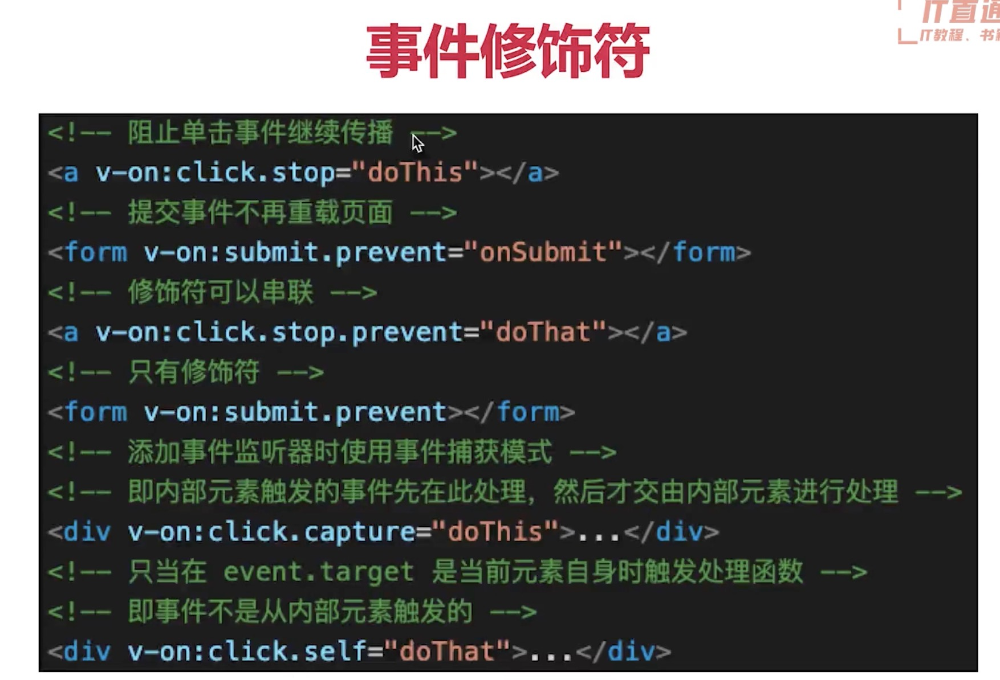

# Vue第一章—Vue的基本使用
## 指令、插值
### 插值、表达式
### 指令、动态属性
### v-html：会有xss也会覆盖子组件
## computed 和 watch
### 对比
1. computed有缓存，data不变则不会重新计算。（提高了运算性能）
2. watch如何深度监听？
3. watch监听引用类型，拿不到oldval

## 如何遍历对象
使用v-for即可，但是要注意key，必须保证key唯一
## key的重要性。key不能乱写
key必须是唯一的，而且key最好与业务相关，如唯一的id。
## v-for 和 v-if 不能一起使用！
在v-for上面不能直接使用v-if，如果需要使用可以给父组件来个v-if
## event对象怎么传过去
可以直接获取，或者通过自定义参数，使用$event即可带过去。  
event.currenttarget指向触发元素  
### 结论：
1. event是原生的
2. 事件被挂载到当前元素

## 事件修饰符

## 按键修饰符
@click.ctrl 监听是否按下ctrl键  
## 表单
1. v-model
2. 常见表单项textarea checkbox radio select
3. 修饰符 lazy number trim

## Vue组件使用
1. props和$emit
2. 组件间通讯 - 自定义事件
3. 组件生命周期

## 生命周期（单个组件）
1. 挂载阶段
   1. 子组件created后直接mounted
   2. 父组件要等子组件mounted成功后才会mounted

2. 更新阶段
3. 销毁阶段

## 总结
1. props和$emit
2. 组件间通讯 - 自定义事件（只要引入一个new vue实例就可以了）
3. 组件生命周期

